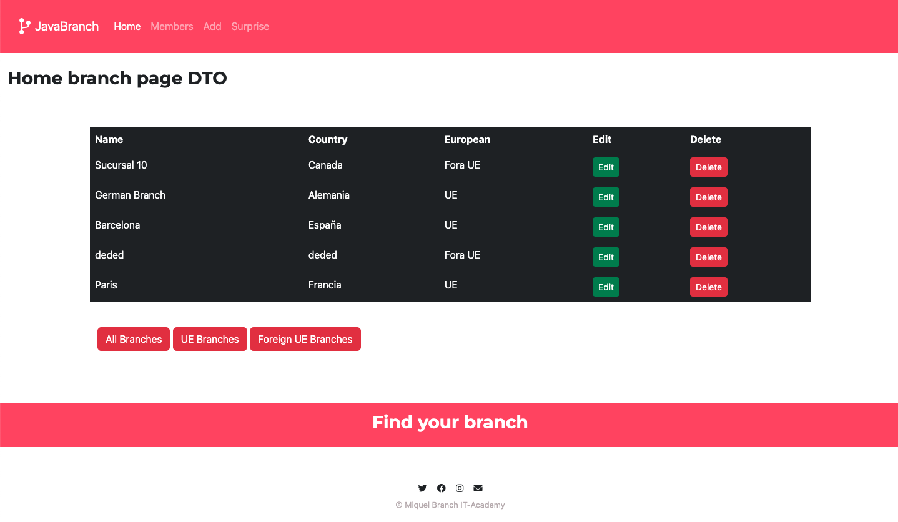
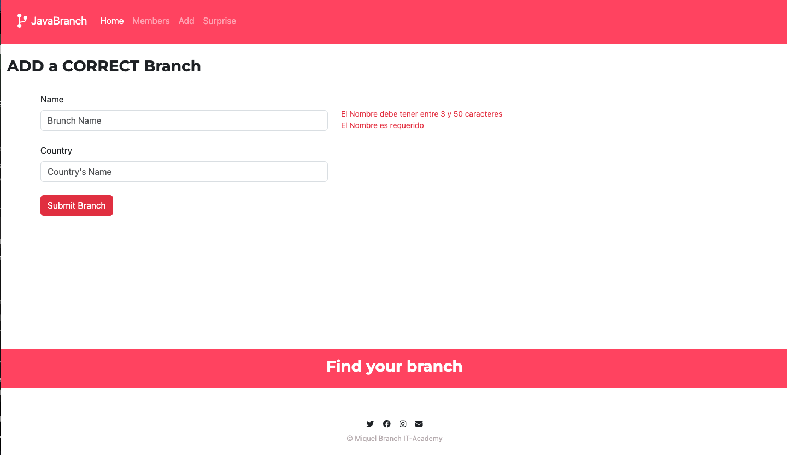
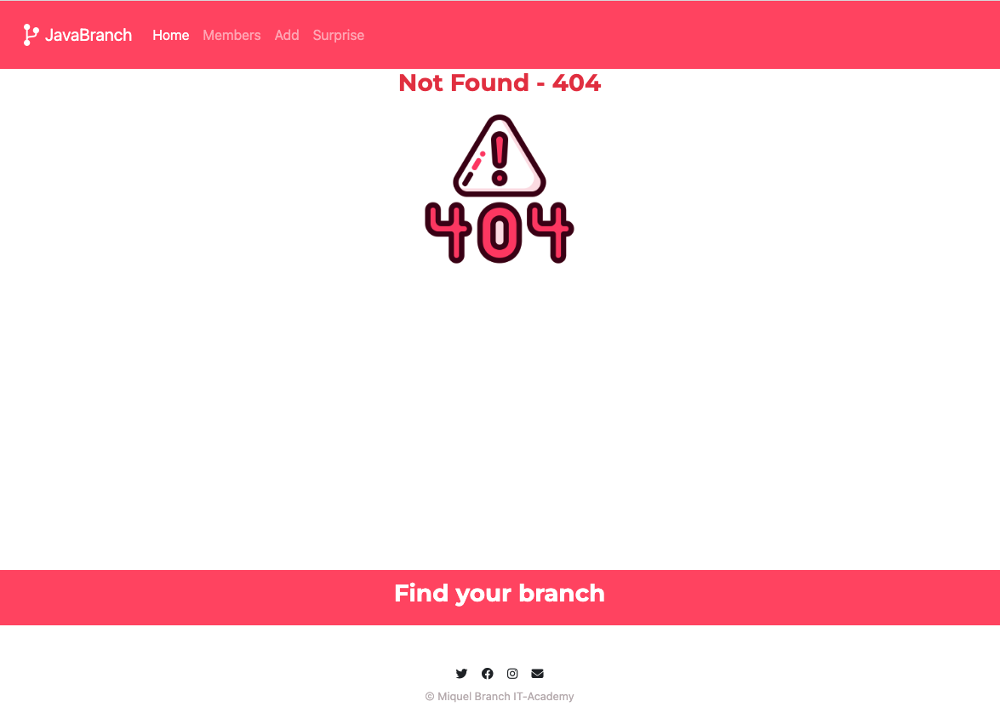
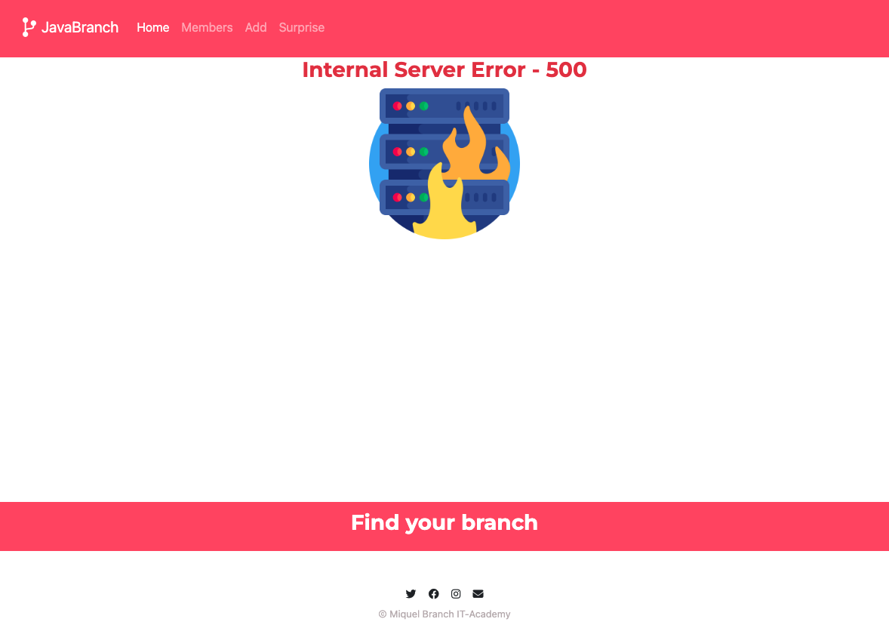

## Web CRUD App with SQL (SpringBoot - Thymeleaf)

In this repository you will find a complete **web application** built with 
SpringBoot and Thymeleaf

 

### Branch web:
- Home Page - DTO Data

- Add Branch with Entity Validation

- Errors:
<table>
 <tr>
    <td>
404
</td>
    <td>
500
</td>
 </tr>
 <tr>
    <td> 
    
    </td>
    <td>
    
    </td>
 </tr>
</table>

 

### References:
DTO 'Data Transfer Objects':
- Video Applied in Java - <a href= "https://www.youtube.com/watch?v=6GWtSKQoliQ&list=PL1YXwF4Lvrn1c9yrsoG3i0aKuYmIf0FjU&index=1"> Youtube Video from 'Programando en Java'</a>
- [Baeldung - DTO Reason](https://www.baeldung.com/java-dto-pattern#:~:text=DTOs%20or%20Data%20Transfer%20Objects,Fowler%20in%20his%20book%20EAA.)
- [javaguides - DTO Java Example](https://www.javaguides.net/2021/02/spring-boot-dto-example-entity-to-dto.html)
- [Video DTO Pattern](https://www.youtube.com/watch?v=6GWtSKQoliQ&list=PL1YXwF4Lvrn1c9yrsoG3i0aKuYmIf0FjU&index=4)

N1 SQL Web app:
- [Spring Boot Thymeleaf-example](https://www.bezkoder.com/spring-boot-thymeleaf-example/)
- [Thymeleaf summary](https://www.baeldung.com/thymeleaf-in-spring-mvc)

Validation
- [Javax Validation](https://www.baeldung.com/javax-validation)

Swagger
- [Swagger](https://www.youtube.com/watch?v=0vqgWQIVfMI&t=2538s)